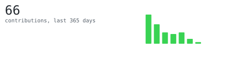
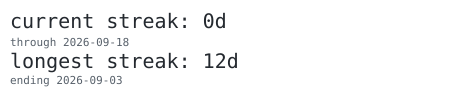
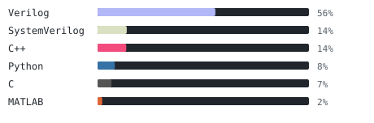
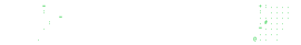

  

<samp>ammar · ECE @ Acropolis Institute of Technology & Research · TCAD & open-source EDA</samp>

<blockquote>
Semiconductor device simulation (NCFETs, FinFETs, GAA/nanowire FETs) on
Synopsys Sentaurus TCAD, plus an open-source analog IC and quantum-computing
stack on the side.
</blockquote>

 

 

 

 

  

<samp>C · C++ · Python · Verilog · SystemVerilog · Octave · TCAD Scheme</samp>
